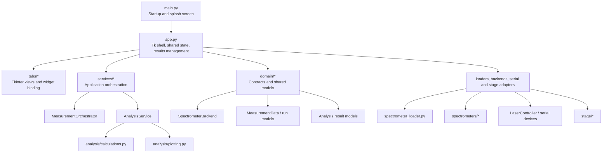
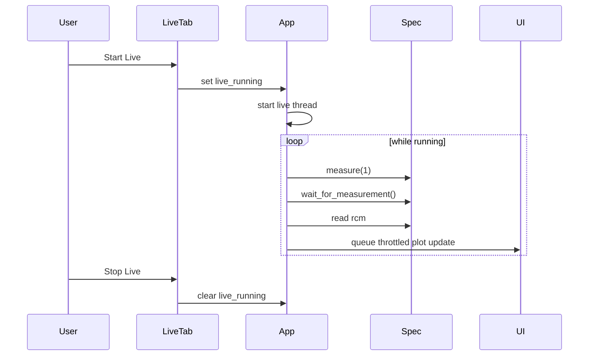
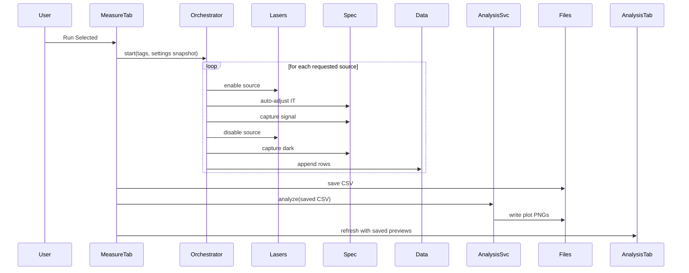

# All Spec Laser Control System Design

Status: Revision 1.1  
Date: 2026-04-06  
Author: Ashutosh Joshi

## Overview

This document describes the architecture that is now in the repository after the April 2026 refactor. It is meant to be practical. The goal is not to describe an idealized future system. The goal is to help the next engineer understand how the application is put together today, why a few structural changes were made, and where the remaining pressure points still are.

All Spec Laser Control is still a desktop lab application built with Python and Tkinter. That has not changed, and it should not be treated as a problem in itself. The software needs to live on a workstation next to the hardware, work offline, and stay usable for operators who are running setup, acquisition, analysis, and maintenance in one place.

What did change is the shape of the code underneath the UI:

- The spectrometer backends now have a formal contract.
- The measurement sequence is no longer buried inside the Measurements tab.
- Analysis calculations are now separated from plot rendering and from UI presentation.
- The GUI does less work per frame, especially in Live View, Auto-IT, and the Analysis tab.

## What The Application Does

At a high level, the application handles a fairly specific lab workflow:

- Discover and connect to one of several supported spectrometer families
- Control external light sources over serial
- Capture live spectra
- Run automated characterization measurements across selected sources
- Save raw measurement data to disk
- Generate analysis outputs and plots for the run
- Provide EEPROM and stage-control utilities where supported

That workflow is still exposed through the same operator-facing tabs:

- Setup
- Live View
- Measurements
- Analysis
- EEPROM

## What Changed In This Revision

The refactor in this revision was aimed at reducing coupling without disturbing the operator workflow.

### 1. Spectrometer backend interface was formalized

The codebase used to rely on a shared, unwritten convention across spectrometer backends. That was workable, but brittle. We now have a concrete runtime contract in `domain/spectrometer.py` built around `SpectrometerBackend`, along with validation helpers used at connection time.

This does two useful things:

- it makes backend expectations obvious
- it fails early if a new backend drifts from the required shape

### 2. Measurement workflow moved into an orchestrator

The measurement sequence used to live directly inside `tabs/measurements_tab.py`. That meant the UI layer was also responsible for source control, Auto-IT, dark capture, special-case handling, and error sequencing.

That logic now lives in `services/measurement_orchestrator.py`. The tab is back to doing UI work: reading operator inputs, starting the run, forwarding progress updates, and showing results.

### 3. Analysis was split into calculation and rendering layers

The old `characterization_analysis.py` module mixed together three different concerns:

- scientific calculations
- plot generation
- the result object handed back to the UI

That has now been separated into:

- `analysis/calculations.py` for metrics and computed analysis structures
- `analysis/plotting.py` for writing plot images
- `services/analysis_service.py` as the orchestration layer used by the app

`characterization_analysis.py` still exists as a small compatibility facade so existing imports do not break.

### 4. GUI responsiveness was improved in a few hot spots

There was no single dramatic performance bug. The sluggishness came from a handful of small things stacking up:

- too many redraw requests during live acquisition
- too many redraw requests during Auto-IT
- the Measurements tab updating its plot aggressively
- the Analysis tab embedding live Matplotlib canvases for every saved plot

Those hotspots were addressed by batching redraws and by switching the Analysis tab to lightweight PNG previews instead of full embedded plot canvases.

## Current Architecture

This is still a single-process desktop application. The difference now is that the internal boundaries are clearer.

The important point here is simple: the UI still drives the application, but the business logic is no longer expected to live inside the tabs.

## Main Modules And Responsibilities

| Module | Responsibility | Notes |
| --- | --- | --- |
| `main.py` | Application startup and splash screen | Small entry point |
| `app.py` | Tk shell, shared state, results directory management, analysis view refresh | Still central, but slimmer than before |
| `tabs/setup_tab.py` | Spectrometer setup, connection flow, configuration UI | Still one of the larger UI modules |
| `tabs/live_view_tab.py` | Live acquisition controls and display | Uses a background loop plus throttled UI redraw |
| `tabs/measurements_tab.py` | Measurement UI, operator input collection, run start/stop | Delegates sequence logic to `MeasurementOrchestrator` |
| `tabs/analysis_tab.py` | Analysis notebook and result presentation | Displays saved image previews instead of live figure canvases |
| `services/measurement_orchestrator.py` | Auto-IT, source sequencing, signal/dark capture, special-case handling | Core measurement workflow service |
| `services/analysis_service.py` | Bridges computed analysis and rendered artifacts | Primary analysis entry point for the app |
| `analysis/calculations.py` | Metric computation and structured analysis data | Pure analysis layer |
| `analysis/plotting.py` | Plot generation and PNG output | Rendering layer only |
| `domain/spectrometer.py` | Backend protocol and runtime validation | Contract boundary for spectrometer adapters |
| `domain/measurement.py` | Measurement row and run data models | Shared run-state model |
| `spectrometer_loader.py` | Discovery, backend selection, connection validation | First stop for spectrometer integration |
| `spectrometers/*.py` | Vendor-specific spectrometer implementations | Still vendor-heavy, still hardware-facing |
| `stage/*` | Stage configuration, communication, safe moves | Separate subsystem |

## Device Boundaries

### Spectrometers

Supported spectrometer families remain:

- Ava1
- Hama2
- Hama3
- Hama4

The shared contract is now explicit. A backend is expected to expose:

- `connect()`
- `disconnect()`
- `set_it(it_ms)`
- `measure(ncy=...)`
- `wait_for_measurement()`
- `rcm`
- `sn`
- `npix_active`

That contract is enforced at runtime through the loader before the backend is handed to the rest of the app.

### Laser and serial-controlled devices

`LaserController` still manages three serial paths:

- OBIS
- CUBE
- RELAY

The orchestrator treats source control as an external dependency and does not know about Tk widgets or COM port entries directly. That separation matters because it keeps the workflow logic testable.

### Stage subsystem

The stage stack is unchanged structurally:

- `StageConfig`
- `ModbusManager`
- `StageController`

The safe move sequence remains encoded in the application layer:

1. move Y to home
2. move X to target
3. move Y to target

That is still the right choice for this system because the safety rule belongs to workflow policy, not just to raw motion control.

## Runtime Workflows

### Startup and setup

Startup is still straightforward:

1. `main.py` shows the splash screen
2. `SpectroApp` initializes the Tk shell
3. tabs are built
4. persisted settings are loaded

Setup then handles device selection and connection. The main difference now is that spectrometer instances are validated against the formal backend contract before the app accepts them.

### Live View

Live View still uses a background acquisition loop. The shape is the same as before, but redraw behavior is calmer.

Two small but useful improvements were made here:

- integration time changes are still deferred safely between frames
- live plot updates are coalesced so the UI thread is not asked to redraw on every possible update

### Measurement and analysis

This is where the architecture changed the most.

The special cases from the old flow are still supported:

- 640 nm uses a multi-integration capture sequence
- Hg-Ar still requires operator-mediated fiber switching
- the application still runs analysis automatically after a successful measurement run

The difference is that those rules now live in one place instead of being spread across the tab implementation.

## Analysis Design

The analysis stack is now deliberately split in two.

### Calculation layer

`analysis/calculations.py` is responsible for:

- normalized LSF extraction
- dark-corrected 640 nm data preparation
- Hg-Ar peak detection and matching
- dispersion fitting
- slit-parameter fitting
- spectral resolution estimation
- structured metric output

This layer returns typed analysis data, not UI widgets and not Tk-specific objects.

### Plotting layer

`analysis/plotting.py` takes the computed structures and writes PNG artifacts. It has no say in how those plots are presented in the GUI.

### Service layer

`services/analysis_service.py` is the small coordinator between those two layers. That keeps `app.py` from having to know how analysis internals are assembled.

### Presentation layer

The Analysis tab now works with saved image files rather than holding full embedded Matplotlib canvases for every result. In practice that makes the tab feel much lighter, especially after several runs.

## Data Model And File Outputs

### In-memory measurement model

`MeasurementData` still holds a denormalized row-oriented capture table. That is a good fit for this application because the CSV output is easy to inspect and easy to move around.

Each row contains:

- `Timestamp`
- `Wavelength`
- `IntegrationTime`
- `NumCycles`
- `Pixel_0 ... Pixel_N`

Signal and dark rows still follow the same naming convention:

- signal: `405`
- dark: `405_dark`

### Persisted outputs

The current layout is:

| Artifact | Location |
| --- | --- |
| Settings | `spectro_gui_settings.json` |
| Run folder | `results/<serial>_<timestamp>/` |
| Raw measurement CSV | run folder root |
| Plot PNGs | `results/<serial>_<timestamp>/plots/` |

Reference CSV overlays are still supported. Expected columns are:

- `Wavelength_nm`
- `WavelengthOffset_nm`
- `LSF_Normalized`

## Concurrency And GUI Responsiveness

This application still uses a simple threaded model, and that is fine for the job it needs to do.

### Threads in play

- UI thread for Tkinter
- live acquisition thread
- measurement thread
- stage thread where applicable
- backend-internal vendor threads where the SDK uses them

### What was improved

The practical GUI improvements in this revision are worth calling out because they affect the day-to-day feel of the app.

- Live plot redraws are throttled instead of being pushed immediately for every frame.
- Auto-IT plot redraws are throttled the same way.
- Measurement plot updates are also batched.
- The measurement worker now snapshots power settings and ports before the run instead of reaching back into Tk widgets throughout the sequence.
- The Hg-Ar countdown is marshaled onto the UI thread instead of trying to create modal UI from the worker thread.
- The Analysis tab displays image previews rather than full embedded figure canvases.

None of those changes are flashy on their own. Together, though, they make the interface feel steadier and less heavy.

## Validation Done For This Refactor

This refactor was verified at code level, not with live hardware attached.

Checks run:

- `python3 -m compileall analysis services app.py tabs`
- `python3 -m unittest discover -s tests`

Basic smoke tests were added for:

- backend contract validation
- measurement orchestrator flow
- analysis service behavior on sparse input

That gives us a decent safety net for the structural refactor. It does not replace real hardware validation.

## Current Strengths

There is still a lot to like about this application.

- The operator workflow is clear and stable.
- The code now has better internal seams without changing the deployment model.
- Spectrometer integrations are easier to reason about because the contract is explicit.
- The measurement workflow is easier to test because it is no longer trapped inside Tk code.
- Analysis now has a cleaner path from computed metrics to rendered artifacts.
- The GUI is more responsive under continuous acquisition and after multi-run analysis sessions.

## Remaining Rough Edges

This revision improves the architecture, but it does not magically finish it.

- `app.py` is still carrying a lot of shared state.
- `tabs/setup_tab.py` is still broader than it should be.
- Results persistence is still handled directly in the app shell rather than in a dedicated repository layer.
- Device capability reporting is still fairly simple.
- Logging is useful for operators, but still not rich enough for serious diagnostics.
- Backend modules under `spectrometers/` are still large and hardware-specific by nature.

That said, the code is in a much better place than it was before this refactor. The biggest maintenance risks were not in the hardware SDK wrappers. They were in the hidden coupling between UI code, workflow logic, and analysis code. That coupling is now reduced.

## Near-Term Next Steps

If work continues in the same direction, the next sensible moves are:

1. pull results persistence into a small repository-style module
2. introduce a dedicated hardware session service for connect/disconnect and capability reporting
3. continue shrinking `app.py` and `tabs/setup_tab.py`
4. add a few more smoke tests around connection setup and analysis edge cases
5. run hardware validation for the refactored measurement path on each supported spectrometer family

## Conclusion

The important thing about this revision is that it keeps the right parts intact. This is still a single desktop application. It still suits the lab environment. Operators do not need to learn a new workflow.

What changed is the internal shape of the code. The backend interface is explicit now. The measurement sequence has a real home. Analysis has been split into calculation and rendering layers. And the UI is doing less unnecessary work while the application is busy.

That is the right kind of progress for this project: lower risk, better structure, no drama.
